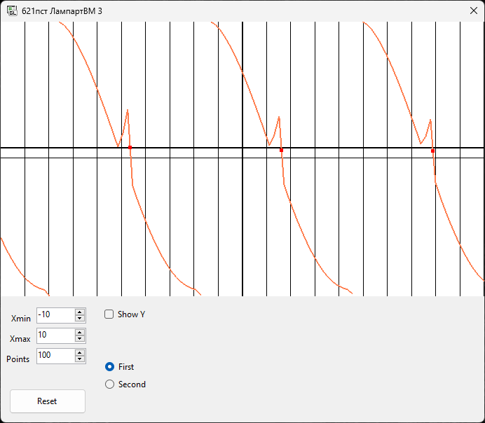
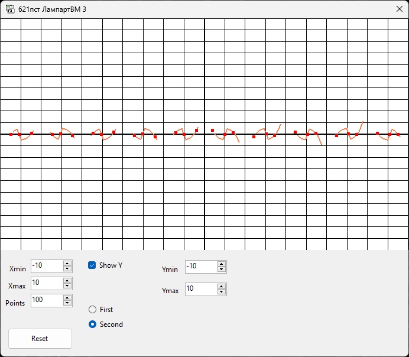
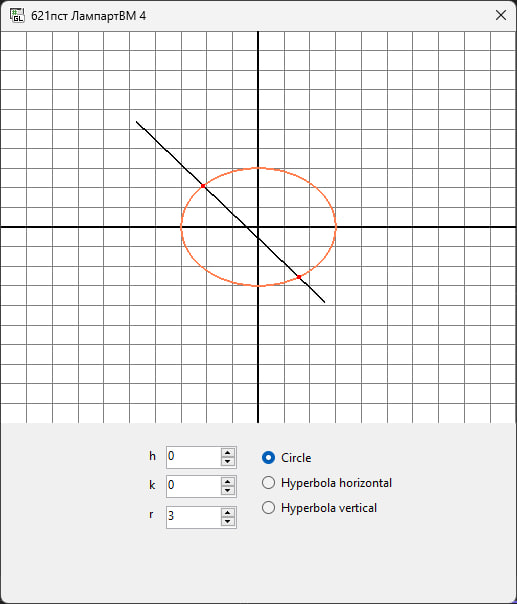
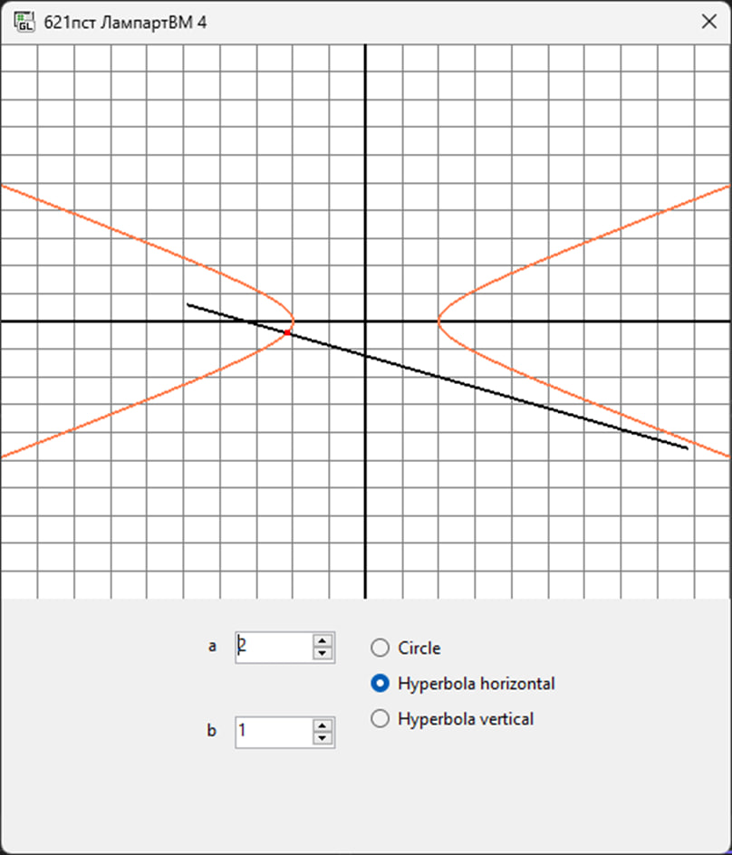
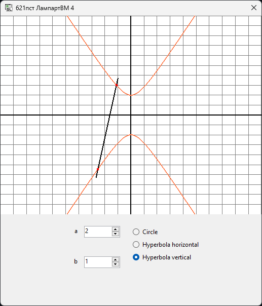

# Лампарт Володимир 621пст
## Репозиторій для практичних робіт з M1.OpenGL.
 
## Практична робота №1. ОСНОВНІ ПРИНЦИПИ РОБОТИ З OPENGL [X]

:---:
*Результат виконання ПР1*

## Практична робота №3. ГРАФІК ФУНКЦІЇ ОДНІЄЇ ЗМІННОЇ [X]

:---:
*Результат виконання ПР3 (Функція 1)*

*Результат виконання ПР3 (Функція 2)*

## Практична робота №4. КРИВІ ДРУГОГО ПОРЯДКУ [X]

:---:
*Результат виконання ПР4 (Крива 1)*

*Результат виконання ПР4 (Крива 2)*

*Результат виконання ПР4 (Крива 3)*