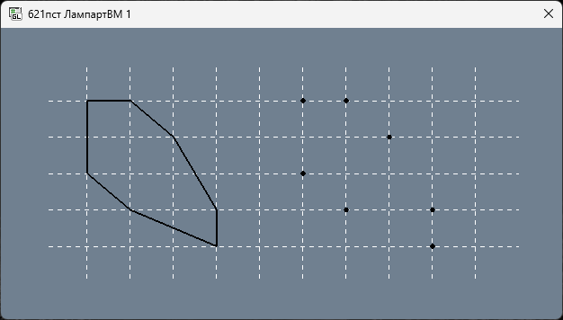
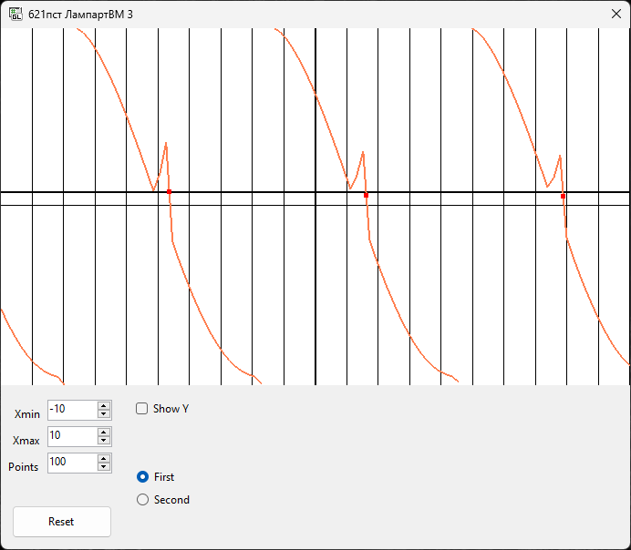
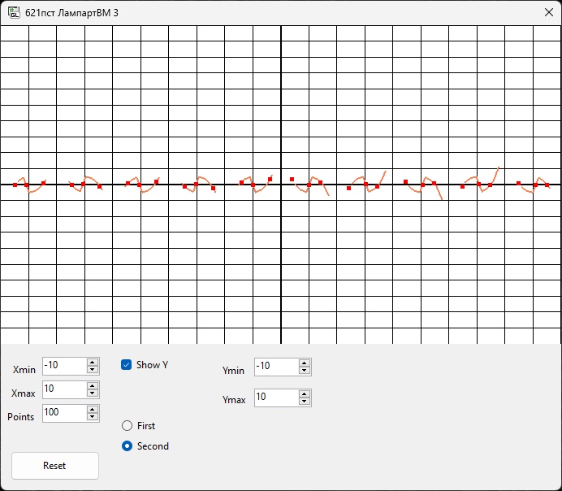

# Лампарт Володимир 621пст
## Репозиторій для практичних робіт з M1.OpenGL.
 
## Практична робота №1. ОСНОВНІ ПРИНЦИПИ РОБОТИ З OPENGL [X]

Результат виконання ПР1

## Практична робота №3. ГРАФІК ФУНКЦІЇ ОДНІЄЇ ЗМІННОЇ [X]

Результат виконання ПР3 (Функція 1)

Результат виконання ПР3 (Функція 1)# Lampart_M1.OpenGL
